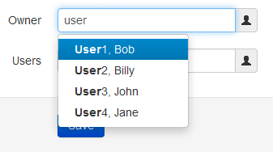
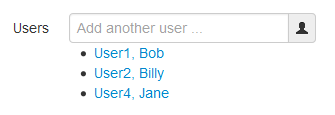

#README#

##Introduction##

This is a [Symfony v2.1](http://symfony.com/) Bundle that provides a 
[Bootstrap](http://twitter.github.com/bootstrap/) 
[Typeahead](http://twitter.github.com/bootstrap/javascript.html#typeahead) autocomplete widget for use in forms. 
An enhanced version of the [Typeahead](http://twitter.github.com/bootstrap/javascript.html#typeahead) component 
is included that adds several new features and enhancements.

###Enhanced Typeahead Features###

* Supports JSON objects
* Caches results
* Delays AJAX request to reduce server requests
* Properly handles pasting via mouse
* Includes an `AJAX Loader` icon

###Screenshots###

This example shows a form field that allows a single name to be entered.



This example shows a form field that allows multiple names to be entered. Clicking on a name link removes the entity. 
The entity in the backend is actually an ArrayCollection and automatically allows adding/removing entities from the list.



##How to install##

**Note:** *This bundle requires jQuery and Bootstrap to be installed in your environment but does not include them 
directly.* I suggest using the [mopa/bootstrap-bundle](https://packagist.org/packages/mopa/bootstrap-bundle) 
which can help with this for you.

* Add `lifo/typeahead-bundle` to your projects `composer.json` "requires" section:

```javascript
{
    // ...
    "require": {
        // ...
        "lifo/typeahead-bundle": "dev-master"
    }
}
```

* Run `php composer.phar update lifo/typeahead-bundle` in your project root.
* Update your project `app/AppKernel.php` file and add this bundle to the $bundles array:

```php
$bundles = array(
    // ...
    new Lifo\TypeaheadBundle\LifoTypeaheadBundle(),
);
```

* Update your project `app/config.yml` file to provide global twig form templates:

```yaml
twig:
    form:
        resources:
            - 'LifoTypeaheadBundle:Form:fields.html.twig'
        
```

* Update your site twig template to initialize the typeahead javascript. There are two options here.
    * In your template add the following twig function call anywhere:

    ```
    {{ lifo_typeahead_init() }}
    ```

    * Or, if you want to combine the javascript with your main site using assetic you can do something like this:
    
    ```
    
        
            <script src="{{ asset_url }}"></script>
        
    
    ```

    * **(Optional)** Add `LifoTypeaheadBundle` to your `app/config/config.yml`. *This is only required if you want to include the typeahead javascript as part of your main site JS using assetic.*

    ```yaml
    assetic:
        bundles: [ 'LifoTypeaheadBundle' ]
    ```

##How to use##

Using the typeahead control is extremely simple. The available options are outlined below:

```php
$builder->add('user', 'entity_typeahead', array(
    'class' => 'MyBundle:User',
    'render' => 'username',
    'route' => 'user_list',
));
```

* **Required Options**
    * `class` is your entity class.
    * `render` is the property of your entity to display in the autocomplete menu.
    * `route` is the name of the route to fetch entities from. The controller matching the route will receive the following parameters via `POST`:
        * `query` The query string to filter results by.
        * `limit` The maximum number of results to return.
* **Optional Options**
    * `route_params` Extra parameters to pass to the `route`.
    * `minLength` Minimum characters needed before firing AJAX request.
    * `items` Maximum items to display at once *(default: 8)*
    * `delay` Delay in milliseconds before firing AJAX *(default: 250)*
    * `loadingIconUrl` Image icon to display during AJAX request.
    *  `multiple` If true the widget will allow multiple entities to be selected. One at a time. This special mode creates an unordered list below the typeahead widget to display the selected entities.
    * `callback` Callback function (or string) that is called when an item is selected. Prototype: `function(text, data)` where `text` is the label of the selected item and `data` is the JSON object returned by the server.

###AJAX Response###
The controller should return a `JSON` array in the following format. Note: `id` and `value` properties are required and you may include any other properties that can potentially be used within the template.

```javascript
[
  { id: 1, value: 'Displayed Text 1' },
  { id: 2, value: 'Displayed Text 2' }
]
```

###Template###

Your form template might look something like this *(The screenshots above used this template bit)*.
**Note:** The `widget_addon` attribute is a `mopa/bootstrap-bundle` attribute.

```twig
{{ form_row(form.name) }}
{{ form_row(form.owner, { attr: { placeholder: 'Search for user ...'}, widget_addon: {type: 'append', 'icon': 'user'}}) }}
{{ form_row(form.users, { attr: { placeholder: 'Add another user ...'}, widget_addon: {type: 'append', 'icon': 'user'}}) }}
```

##Notes##

This bundle renders its form elements in standard Symfony style. You will have to override the form blocks to get the proper Bootstrap styles applied. I strongly suggest something like [mopa/bootstrap-bundle](https://packagist.org/packages/mopa/bootstrap-bundle) that will override the symfony form templates with proper Bootstrap versions automatically for you.
